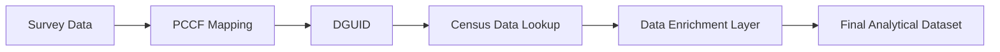
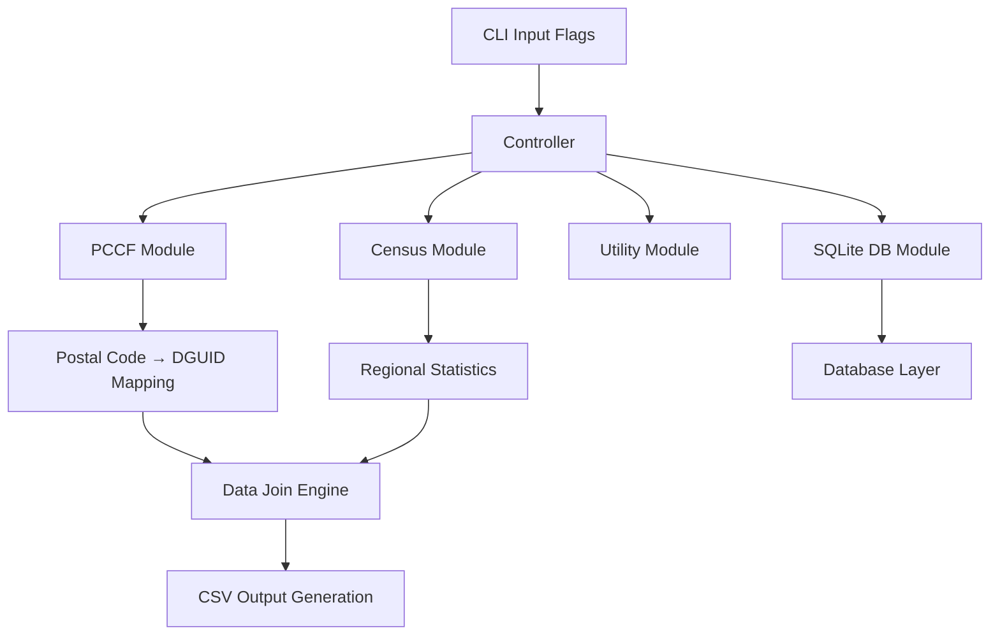

# Ourboro Data System

## Overview

The **Ourboro Data System** is a Rust-based data enrichment pipeline that connects **survey data containing postal codes** with **Canadian census data** through geographic mapping.

Survey datasets alone are limited because postal codes do not directly provide socioeconomic context. This system enriches those records by linking postal codes to standardized geographic identifiers and then attaching census-level statistics.

The final output is an **analysis-ready dataset** that combines individual survey responses with regional demographic and socioeconomic indicators.

---

## Purpose

The purpose of this system is to transform raw survey data into context-rich datasets that enable deeper analysis of relationships between individuals and their environments.

In particular, the system allows researchers to:

- Map postal codes to standardized geographic regions
- Attach census-level statistics (population, housing, income, etc.)
- Enable region-aware interpretation of survey responses
- Support comparative analysis across geographic areas

---

## Data Pipeline Flow


---

## Pipeline Stages

**1. Survey Input**  
Contains raw responses with postal codes.

**2. PCCF Mapping**  
Converts postal codes into geographic identifiers (DGUID).

**3. Census Join**  
Retrieves demographic and socioeconomic data based on DGUID.

**4. Enrichment Layer**  
Combines survey + regional statistics.

**5. Output Generation**  
Produces CSV files for downstream analysis.

---

## Key Concepts

- **Postal Code**  
A user-provided geographic identifier (e.g., N2G 3W5)

- **PCCF (Postal Code Conversion File)**  
A reference dataset used to map postal codes to standardized geographic regions.

- **DGUID (Dissemination Area Unique Identifier)**  
A geographic identifier used by Statistics Canada to define census regions.

- **Census Data**  
Aggregated statistical data describing population, income, housing, and demographics at the regional level.

---

## System Architecture



---

## Execution Model (CLI-Based System)

The system is controlled via a command-line interface (CLI).  
Each flag acts as a control switch that determines which part of the pipeline is executed.

When the program starts, CLI arguments are parsed into a configuration object, and execution paths are conditionally activated.

---

## Execution Modes

- `--ourboro` → Runs full enrichment pipeline (postal → DGUID → census join)
- `--db` → Initializes SQLite database and loads PCCF data
- `--xlsx` → Converts Excel files into CSV format
- `--sample` → Outputs sample census data for inspection
- `--create_sql` → Generates SQL queries from input datasets

These modes can be combined to execute multiple workflows in a single run.

---

## Input Configuration Options

In addition to execution modes, the system supports configurable inputs:

- `--input` → Input dataset path
- `--output` → Output file path
- `--take` → Number of rows to process
- `--skip` → Skip initial rows
- `--postal` → Filter by postal code
- `--province` → Filter by province
- `--population` / `--income` → Enable additional feature extraction

---

## Design Rationale

This system is designed as a **modular data processing engine** with runtime-configurable behavior.

### Key design principles:

- **Modularity**: Each function (PCCF, census, DB, utilities) is isolated
- **Flexibility**: Multiple execution modes via CLI flags
- **Scalability**: New pipelines can be added without restructuring core logic
- **Reproducibility**: Same pipeline can be executed consistently via CLI

---

## Advanced Analysis: Group A/B Structure

Some datasets used by this system contain paired postal codes in the following format:

```text id="kq2l1m"
user_id | postal_code_A | postal_code_B
```
### Interpretation

- **Group A**: First geographic region  
- **Group B**: Comparison region  

Each group is independently mapped through:

```text
Postal Code → DGUID → Census Data
```

### Purpose

This structure enables **comparative regional analysis**, allowing researchers to examine how different geographic contexts may influence survey responses.

> Note: This is not a “real vs synthetic” distinction. Both A and B are pre-defined input fields used for comparative analysis.

---

## Output

The final dataset includes:

- Survey responses  
- Postal codes  
- DGUID geographic identifiers  
- Census attributes (income, population, housing, etc.)  
- Optional comparative group analysis (A vs B)

---

## Tech Stack

- Rust (core processing engine)  
- Clap (CLI parsing)  
- Tokio (async runtime)  
- SQLite (optional storage layer)  
- CSV/XLSX processing utilities  
- Statistics Canada PCCF dataset  
- Canadian Census datasets  

---

## Summary

The Ourboro Data System is a **geospatial data enrichment pipeline** that transforms raw survey data into context-aware analytical datasets.

This allows individual survey responses to be interpreted within their broader socioeconomic and regional context.

