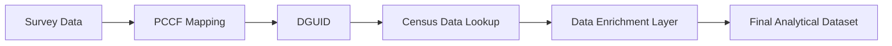
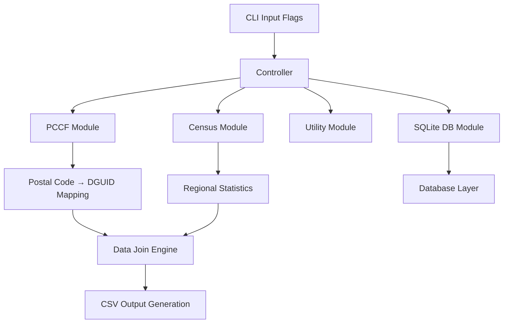

# Ourboro Data System

## Overview

The Ourboro Data System is a data processing pipeline that enriches survey data by linking postal codes to Canadian census geographic and statistical data.

The system supports:

- Mapping postal codes to standardized geographic regions
- Attaching census-level statistics (population, housing, income, etc.)
- Supporting geographic comparison across different areas
- Generating enriched datasets for downstream analysis

It supports CLI-based execution for different data processing workflows such as database initialization, data conversion, and full pipeline execution.

---

## Requirements

- PCCF (Postal Code Conversion File)

PCCF is a Statistics Canada dataset used to map postal codes to geographic identifiers (DGUIDs).

Access to the PCCF dataset is required to use PCCF-based mapping features. The dataset may require institutional access, licensing, or purchase depending on usage.

---

## Data Pipeline Flow


---

## Pipeline Stages

**1. Survey Input**  
Contains raw responses with postal codes.

**2. PCCF Mapping**  
Converts postal codes into geographic identifiers (DGUID).

**3. Census Join**  
Retrieves demographic and socioeconomic data based on DGUID.

**4. Enrichment Layer**  
Combines survey + regional statistics.

**5. Output Generation**  
Produces CSV files for downstream analysis.

---

## Key Concepts

- **Postal Code**  
A user-provided geographic identifier (e.g., N2G 3W5)

- **PCCF (Postal Code Conversion File)**  
A reference dataset used to map postal codes to standardized geographic regions.

- **DGUID (Dissemination Area Unique Identifier)**  
A geographic identifier used by Statistics Canada to define census regions.

- **Census Data**  
Aggregated statistical data describing population, income, housing, and demographics at the regional level.

---

## System Architecture



---

## Execution Model (CLI-Based System)

The system is controlled via a command-line interface (CLI).  
Each flag acts as a control switch that determines which part of the pipeline is executed.

When the program starts, CLI arguments are parsed into a configuration object, and execution paths are conditionally activated.

---

## Execution Modes

- `--ourboro` → Runs full enrichment pipeline (postal → DGUID → census join)
- `--db` → Initializes SQLite database and loads PCCF data
- `--xlsx` → Converts Excel files into CSV format
- `--sample` → Outputs sample census data for inspection
- `--create_sql` → Generates SQL queries from input datasets

These modes can be combined to execute multiple workflows in a single run.

### Example Command

To run the full enrichment pipeline:

```text
cargo run -- --ourboro --input input.csv --output output.csv
```

---

## Input Configuration Options

In addition to execution modes, the system supports configurable inputs:

- `--input` → Input dataset path
- `--output` → Output file path
- `--take` → Number of rows to process
- `--skip` → Skip initial rows
- `--postal` → Filter by postal code
- `--province` → Filter by province
- `--population` / `--income` → Enable additional feature extraction

---

## Ourboro Mode Details

### Paired Postal Code Analysis (`--ourboro` Mode)

This mode is designed for analyzing before-and-after relocation data.

### Input Data Format

```text
user_id | starting_postal_code | finishing_postal_code
```
- Starting Postal Code: Original location
- Finishing Postal Code: New location

### Processing Flow

- Starting postal code → DGUID → Census data enrichment  
- Finishing postal code → DGUID → Census data enrichment  

Both results are combined into a single output row for comparison.

---

## Output

The final dataset includes:

- Survey responses  
- Postal codes  
- DGUID geographic identifiers  
- Census attributes (income, population, housing, etc.)  
- Starting and finishing location data (when using `--ourboro` mode)

---

## Tech Stack

- Rust (core processing engine)  
- Clap (CLI parsing)  
- Tokio (async runtime)  
- SQLite (optional storage layer)  
- CSV/XLSX processing utilities  
- Statistics Canada PCCF dataset  
- Canadian Census datasets  

---

## Summary

The Ourboro Data System is a **geospatial data enrichment pipeline** that transforms raw survey data into context-aware analytical datasets.

This allows individual survey responses to be interpreted within their broader socioeconomic and regional context.


  
