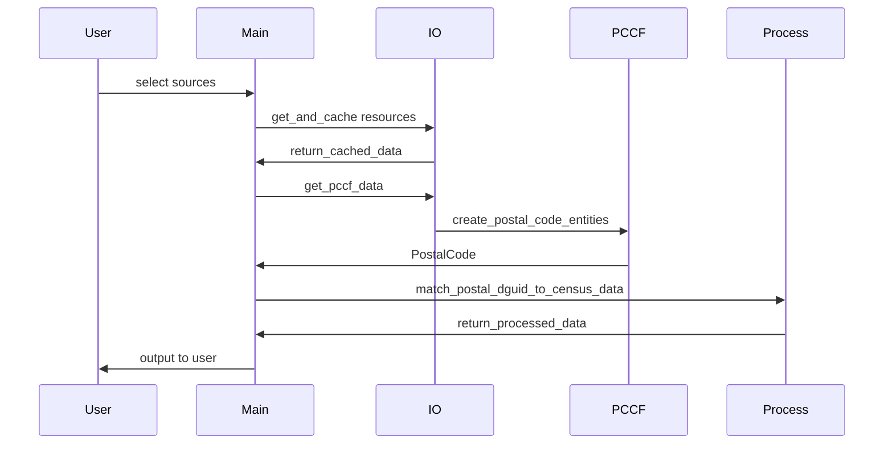
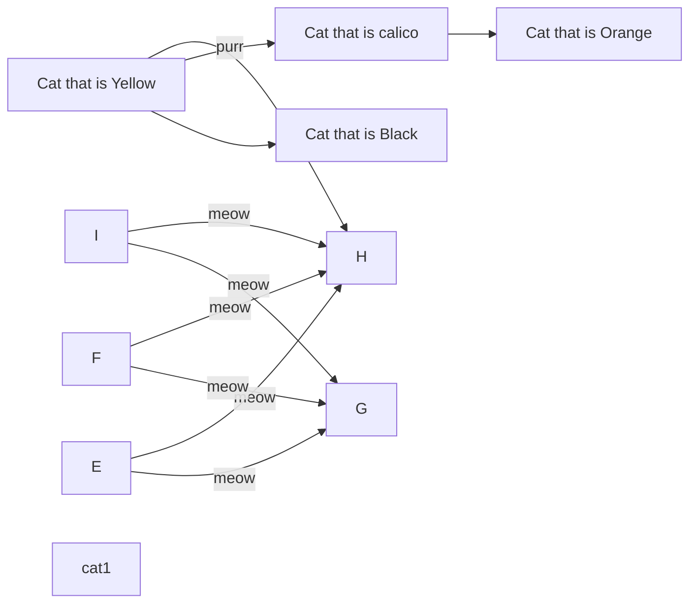

# PCCF Reader Architecture

## HEader 2

```mermaid

sequenceDiagram
  User ->> Main : select sources
  Main ->> IO : get_and_cache resources
  IO ->> Main : return_cached_data
  Main ->> IO : get_pccf_data
  IO ->> PCCF : create_postal_code_entities
  PCCF ->> Main : PostalCode
  Main ->> Process : match_postal_dguid_to_census_data
  Process ->> Main : return_processed_data
  Main ->> User : output to user


  

```

```mermaid

  flowchart LR
    A[Cat that is Yellow] --> B[Cat that is Black]
    C[Cat that is calico] --> D[Cat that is Orange]
    A -- purr --> C
    E & F & I -- meow --> G & H
    A --> H
    cat1

```
