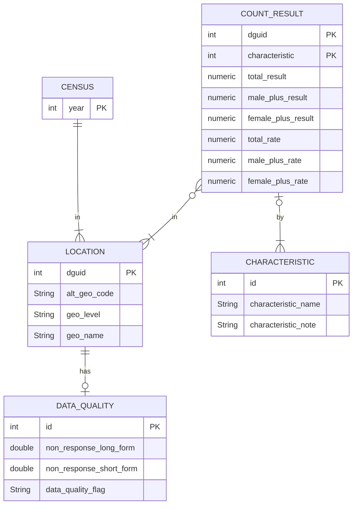

## Application Approach

```mermaid

erDiagram
    CENSUS {
        int year PK
    }

    LOCATION {
        int dguid PK
        String alt_geo_code
        String geo_level
        String geo_name
    }

    DATA_QUALITY {
        int id PK
        double non_response_long_form
        double non_response_short_form
        String data_quality_flag
    }

    CHARACTERISTIC {
        int id PK
        String characteristic_name
        String characteristic_note
    }

    COUNT_RESULT {
        int dguid PK
        int characteristic PK
        numeric total_result
        numeric male_plus_result
        numeric female_plus_result
        numeric total_rate
        numeric male_plus_rate
        numeric female_plus_rate
    }

    LOCATION ||--o| DATA_QUALITY : has
    COUNT_RESULT }o--|{ LOCATION : in
    COUNT_RESULT |o--|{ CHARACTERISTIC : by
    CENSUS ||--|{ LOCATION : in


```